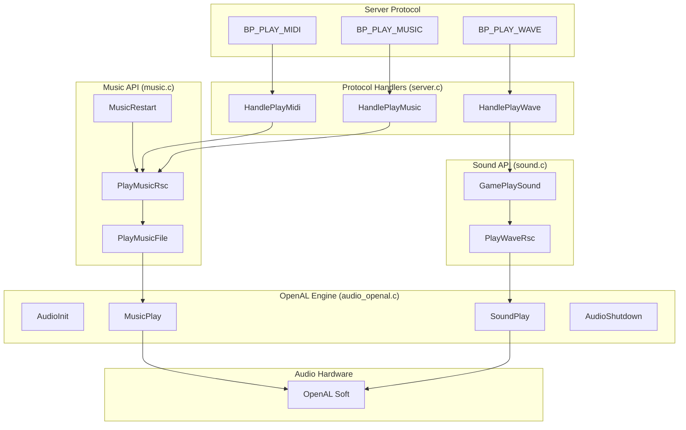

# Meridian 59 Audio System

## Overview

The client audio system was refactored in PR #1293 (Q4 2025 / Q1 2026) to replace the proprietary Miles Sound System (MSS) and WaveMix with OpenAL Soft, an open-source, cross-platform audio library.

## Architecture



## Before vs After

| Aspect | Before (MSS/WaveMix) | After (OpenAL Soft) |
|--------|---------------------|---------------------|
| **License** | Proprietary (cannot distribute) | LGPL (open source) |
| **Music Format** | MIDI, MP3 | OGG Vorbis |
| **Sound Format** | WAV | WAV, OGG Vorbis |
| **3D Audio** | None | Positional audio with distance falloff |
| **Caching** | None | LRU buffer cache (256 entries) |
| **Platform** | Windows only | Cross-platform |

## Function Reference

### Engine Layer (audio_openal.c)

| Function | Purpose |
|----------|---------|
| `AudioInit(hwnd)` | Initialize OpenAL device, context, and sources |
| `AudioShutdown()` | Clean up all audio resources |
| `MusicPlay(filename, loop)` | Play OGG file on dedicated music source |
| `MusicStop()` | Stop music playback |
| `MusicSetVolume(volume)` | Set music volume (0.0 - 1.0) |
| `SoundPlay(filename, volume, flags, ...)` | Play sound effect with optional 3D positioning |
| `SoundStopAll()` | Stop all sound effects |
| `AudioUpdateListener(x, y, z, ...)` | Update listener position for 3D audio |

### Music API (music.c)

| Function | Exported | Purpose |
|----------|----------|---------|
| `PlayMusicFile(hwnd, filename)` | ? | Play music by filename (handles .mid/.mp3 ? .ogg) |
| `PlayMusicRsc(rsc)` | ? | Play music by resource ID |
| `MusicAbort()` | ? | Stop all music |
| `MusicRestart()` | ? | Resume music when user re-enables in settings |
| `MusicClose()` | ? | Shutdown music system |
| `NewMusic(type, rsc)` | ? | Handle server music message |
| `ResetMusicVolume()` | ? | Apply volume from config |

### Sound API (sound.c)

| Function | Purpose |
|----------|---------|
| `PlayWaveRsc(rsc, ...)` | Play sound effect by resource ID |
| `PlayWaveFile(filename, ...)` | Play sound effect by filename |
| `GamePlaySound(rsc, ...)` | Entry point from server protocol |
| `SoundAbort()` | Stop all sounds |

## API Consolidation (PR #1293)

The following functions were removed to simplify the API:

| Removed | Reason |
|---------|--------|
| `MusicInitialize()` | Folded into `AudioInit()` |
| `PlayMidiFile()` | Redundant - `PlayMusicFile()` handles .mid conversion |
| `PlayMidiRsc()` | Redundant - `HandlePlayMidi` now calls `PlayMusicRsc` directly |
| `MusicDone()` | Was an empty stub |
| `MusicStart()` | Renamed to `MusicRestart()` for clarity |

## File Format Conversion

Legacy music files (.mid, .midi, .mp3) are automatically mapped to .ogg:

```
main.mid  ? main.ogg
theme.mp3 ? theme.ogg
```

This mapping happens in `ConvertLegacyMusicExtension()` in music.c.

## Buffer Caching

Sound effects are cached using an LRU (Least Recently Used) strategy:

- **Cache size:** 256 buffers maximum
- **Eviction:** Oldest unused buffer is evicted when cache is full
- **Protection:** Buffers currently playing are never evicted
- **Lookup:** O(1) via case-insensitive hash map

Music is NOT cached because tracks are large and typically don't repeat rapidly.

## 3D Positional Audio

### Which Sounds Are Positional?

Not all sounds use 3D positioning. This matches the original MSS behavior where all sounds
played at equal volume in both stereo channels (no panning).

| Sound Type | Positional? | Rationale |
|------------|-------------|----------|
| `SF_RANDOM_PLACE` | No | Periodic ambient sounds (server picks random location) |
| `SF_LOOP` at coords (1,1) or (2,2) | No | Background atmosphere using placeholder coordinates |
| `SF_LOOP` at real coords | Yes | Localized objects (fountains, torches, etc.) |
| Other sounds with coords | Yes | Combat, spells, object interactions |
| Sounds at (0,0) | No | No position specified, play centered |

### Distance Model

- **Model:** Linear distance clamped
- **Reference distance:** 1 tile (full volume)
- **Max distance:** Radius from server (silence beyond)
- **Coordinate mapping:** Game coords to OpenAL coords (X negated for handedness)

### Coordinate System

All audio positioning uses **tile coordinates** (coarse grid), not fine coordinates:

- **Fine coords:** High precision (e.g., 39424, 56832), used for smooth player movement
- **Tile coords:** Coarse grid (e.g., 56, 18), conversion: `tile = fine >> LOG_FINENESS`

`GamePlaySound()` normalizes object positions (fine) to tile coords before calling audio.
`UpdateLoopingSounds()` converts player position (fine) to tile coords for the listener.
Server-provided ambient sound positions are already in tile coords.

The listener position is updated each frame via `AudioUpdateListener()`.

## Configuration

Audio settings in `meridian.ini`:

```ini
[Meridian]
MusicVolume=40      ; 0-100
SoundVolume=99      ; 0-100
AmbientVolume=100   ; 0-100 (looping/3D sounds)
```

## HRTF and Surround Sound

OpenAL Soft supports multiple audio output modes configured via `alsoft.ini` (user's AppData or game directory):

### HRTF (Headphone 3D Audio)

Head-Related Transfer Function simulates 3D audio for headphone users by applying filters
that mimic how sound reaches your ears from different directions.

To enable HRTF, create or edit `alsoft.ini`:

```ini
[general]
hrtf = true
```

OpenAL Soft ships with built-in HRTF data. Additional HRTF profiles (.mhr files) can be
placed in the OpenAL Soft data directory.

### Surround Sound (5.1 / 7.1)

OpenAL Soft automatically detects and uses your system's speaker configuration. For
multi-channel setups (5.1, 7.1), 3D positional sounds will be correctly spatialized
across all speakers.

To force a specific output mode in `alsoft.ini`:

```ini
[general]
channels = surround51   ; Options: mono, stereo, quad, surround51, surround61, surround71
```

No game configuration is required—OpenAL Soft handles speaker routing automatically
based on your Windows audio device settings.

## Dependencies

- **OpenAL Soft 1.24.3** - Audio engine (`OpenAL32.lib`, `OpenAL32.dll`)
- **stb_vorbis** - OGG Vorbis decoder (single-header library)
