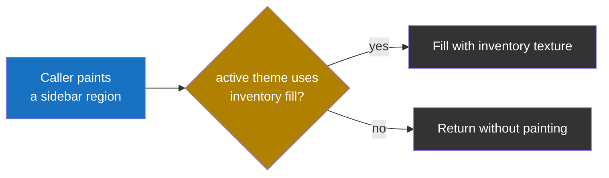
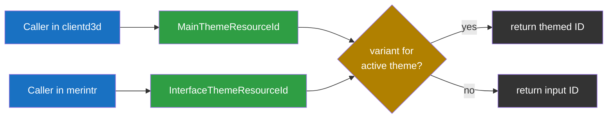

# Themes

The client supports swappable UI themes selected from the Settings dialog under Interface Features.  Theme swaps take effect without a restart.

Two themes ship today: `Theme::Default` (the original Meridian 59 palette) and `Theme::Dark` (a dark theme).

A theme covers two kinds of surface: colors and bitmaps.

## Color theming

Theme definitions and the abstraction that hides them live in `clientd3d/color.c` and `clientd3d/srvrstr.c`.  The rest of the client asks for a color or brush by name (`GetColor(COLOR_X)`, `GetBrush(COLOR_X)`) and is theme-blind.

The active theme is stored in `Config::theme` (the `Theme` enum in `clientd3d/config.h`).  Each theme keeps its customized colors in its own INI section (e.g. `[Colors]`, `[ColorsDark]`) so switching themes does not clobber the other theme's saved values.

## Bitmap surfaces

Bitmap theming is per-surface.  A surface is themed when a `_DARK` (or other theme-specific) variant exists and the code path routes the ID through a resolver.  Surfaces without a variant render the default art under every theme.

Three kinds of themeable bitmap surface exist:

- Tiled backgrounds: the main window background and the inventory texture.
- Wrapper ornaments: decorative corner + edge-repeater bitmaps drawn around the major UI regions.
- Button and icon art: toolbar buttons, stat-tab buttons, mailbox icon.

The wrapper ornaments live in `module/merintr/drawint.c`.  Five groups exist today:

| Group | Wraps | Dark variants today |
| ----- | ----- | ------------------- |
| `E*` | Outer client-window edge | Yes |
| `M*` | Minimap | Yes |
| `S*` | Stats area outer panel | No (skipped in dark) |
| `B*` | Chat edit box | No (silver in dark) |
| `I*` | Inventory area | No (skipped for every theme) |

## Sidebar fill

The right sidebar (enchantments, portrait, stat bars) sits inside the main window.  Two fill strategies exist for the sidebar area:

- Show the main window background through any gaps between drawn elements.
- Paint the sidebar with the inventory texture so it has its own fill.

Each theme picks one.  The choice depends on whether the main window background reads well behind the portrait and stat bars.  For example, the dark theme paints the inventory texture across the sidebar because the dark main window background lacks contrast against the portrait; the default theme leaves the main window background visible.

## Per-module bitmap resolvers

Each module owns its own bitmap IDs in its own `resource.h`.  The ID values are not shared across modules, so each module ships its own resolver:

| Module | Resolver | Themed bitmaps today |
| ------ | -------- | -------------------- |
| `clientd3d` | `MainThemeResourceId` | Main window background |
| `module/merintr` | `InterfaceThemeResourceId` | Inventory texture; window-edge and minimap wrapper ornaments |

Other client modules (`admin`, `char`, `chess`, `dm`, `mailnews`) contain bitmaps but have no themed variants today.

A resolver takes a default-theme bitmap ID and returns the variant for the active theme.  If the active theme has no variant for that ID, the resolver returns the input unchanged.

## Adding a new theme

The major components to touch:

1. The `Theme` enum in `clientd3d/config.h`.
2. The color tables and INI machinery in `clientd3d/color.c`.
3. Server message colors in `clientd3d/srvrstr.c` (optional).
4. The Settings UI: localized string in `clientd3d/client.rc` and combo entry in `clientd3d/preferences.c`.
5. Bitmap variants (optional): author `_<NAME>` BMP files and extend the per-module bitmap resolvers in `clientd3d/color.c` and `module/merintr/theme.c`.
6. Theme capability switches in `module/merintr/theme.c`.
