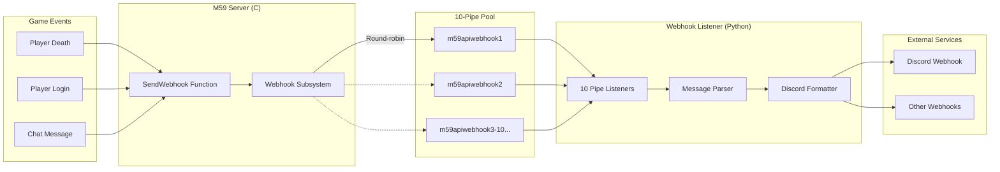
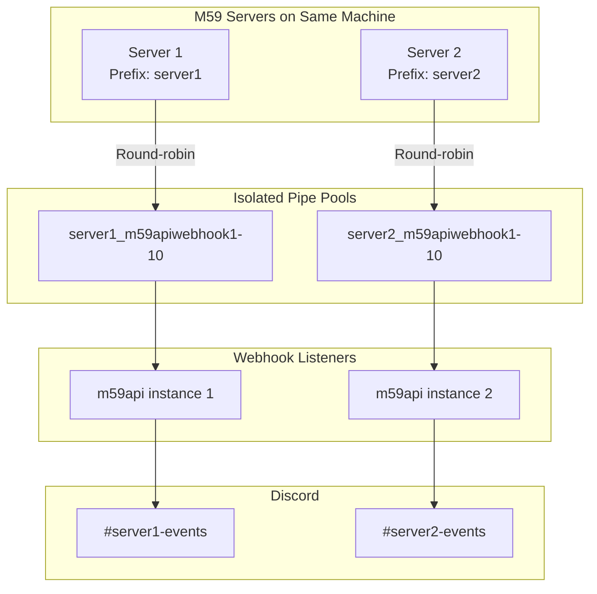

# Meridian 59 Webhook System

The Meridian 59 webhook system enables the game server to send real-time notifications to external services (like Discord) via named pipes or FIFO pipes. This system is designed for performance, reliability, and multi-server support.

**Note: Webhooks are disabled by default.** You must enable them in your server configuration.

**Important: Changing webhook settings requires a server restart.** The webhook enabled/disabled state is checked once at startup and cached for performance. If you enable or disable webhooks in `blakserv.cfg`, you must restart the server for the change to take effect.

## Quick Start

### 1. Enable Webhooks
Add this to your `blakserv.cfg` configuration file:
```ini
[Webhook]
Enabled              Yes
```

**Optional - For multiple servers on same machine:**
```ini
[Webhook]
Enabled              Yes
Prefix               server1
```

### 2. Install Webhook Listener
```bash
pip install m59api
```

### 3. Configure Discord Webhook (Required for Discord integration)
Set the Discord webhook URL environment variable:

**Windows PowerShell:**
```powershell
$env:DISCORD_WEBHOOK_URL = "https://discord.com/api/webhooks/your/webhook/url"
```

**Linux/macOS:**
```bash
export DISCORD_WEBHOOK_URL="https://discord.com/api/webhooks/your/webhook/url"
```

To get a Discord webhook URL: Server Settings ? Integrations ? Webhooks ? Create New Webhook

### 4. Start the Services (Order is Important!)
```bash
# Terminal 1: Start webhook listener FIRST
m59api webhook

# Terminal 2: Start your M59 server SECOND
./blakserv
```

**?? Important:** The webhook listener must be started before the M59 server, as the server connects to pipes created by the listener. If you start the server first, webhooks will silently fail - the server will run normally but no webhook messages will be sent. You would need to start the webhook listener and then restart the server to fix this.

That's it! Game events will now appear in Discord.

## Architecture Overview

The webhook system uses a **client-server pipe architecture**:

- **Webhook Listener (Python)**: Creates and manages pipe servers, forwards messages to Discord/webhooks
- **Meridian 59 Server (C)**: Connects to pipes as a client, sends webhook messages

One example webhook listener is [m59api](https://pypi.org/project/m59api/), but any compatible pipe listener can be used.



### Multi-Server Support

Running multiple M59 servers on the same machine requires using **prefixes** to create separate pipe pools.

**Why prefixes are required:**
- Each server needs its own Discord channel (to know which server an event came from)
- Named pipes only allow one writer at a time
- Without prefixes, servers would compete for the same 10 pipes

**Setup Example (2 servers):**

```ini
# Server 1: blakserv1.cfg
[Webhook]
Enabled = Yes
Prefix = server1

# Server 2: blakserv2.cfg
[Webhook]
Enabled = Yes
Prefix = server2
```

**Start webhook listeners (different Discord channels):**

```bash
# Terminal 1 - Server 1 events go to #server1-events channel
DISCORD_WEBHOOK_URL="https://discord.com/api/webhooks/.../server1" m59api webhook --webhook-prefix server1

# Terminal 2 - Server 2 events go to #server2-events channel
DISCORD_WEBHOOK_URL="https://discord.com/api/webhooks/.../server2" m59api webhook --webhook-prefix server2
```

**Result:**
- Server 1: Uses `server1_m59apiwebhook1-10` ? Discord #server1-events channel
- Server 2: Uses `server2_m59apiwebhook1-10` ? Discord #server2-events channel
- Total: 20 pipes on same machine, complete isolation

**Architecture:**



## How It Works

### 1. Pipe Creation (webhook listener side)
When the webhook listener starts, it creates multiple named pipes to handle connections:

**Windows**: Creates 10 named pipes
- `\\.\pipe\m59apiwebhook1`  
- `\\.\pipe\m59apiwebhook2`
- ... up to `\\.\pipe\m59apiwebhook10`

**Linux/macOS**: Creates 10 FIFO pipes
- `/tmp/m59apiwebhook1`
- `/tmp/m59apiwebhook2`  
- ... up to `/tmp/m59apiwebhook10`

### 2. Connection (M59 server side)
When the Meridian 59 server starts:

1. **Initialization**: `InitWebhooks()` checks if webhooks are enabled in config and prepares internal state
2. **Lazy Connection**: On first message send, server attempts to connect to available pipes
3. **Claiming**: First available pipe is claimed and kept open for subsequent messages
4. **Messaging**: `SendWebhookMessage()` writes to the connected pipe
5. **Cleanup**: `ShutdownWebhooks()` closes connections on server shutdown

**Performance Optimization**: When webhooks are disabled, `IsWebhookEnabled()` returns false immediately, avoiding all string processing and JSON building. This is why changing the webhook config requires a server restart - the enabled state is cached at startup for performance.

### 3. Message Flow
```
1. Game Event (e.g., player death)
2. Blakod calls SendWebhook("Player died: Bob killed by Alice")  
3. C_SendWebhook() ? SendWebhookMessage()
4. Format as JSON: {"timestamp":1234567890,"message":"Player died: Bob killed by Alice"}
5. Write to claimed pipe
6. Webhook listener receives message
7. Webhook listener forwards to Discord webhook
8. Discord posts to channel
```

## Performance Features

### Load Balancing

Each server uses round-robin selection across its 10 connected pipes for better distribution and fault tolerance. This allows a high-traffic server to spread its load across multiple pipes for better throughput.

### High-Traffic Performance
The multi-pipe architecture prevents message dropping during high-traffic scenarios:

**Example - Multiple simultaneous events:**
```
Player 1 dies ? m59apiwebhook1 ? Concurrent processing
Player 2 dies ? m59apiwebhook2 ? Concurrent processing  
Player 3 dies ? m59apiwebhook3 ? Concurrent processing
All messages processed simultaneously without blocking
```

**Without multi-pipe design:**
- Single pipe processes one message at a time
- Subsequent messages could be blocked or dropped
- Performance degrades under load

## Performance Features

### Persistent Connections

- **Problem**: Opening/closing pipes for every message is expensive
- **Solution**: Pipes are connected on-demand and kept open for subsequent messages
- **Result**: Only one write operation per message after initial connection

### Non-blocking Operations  
- Pipe operations use `O_NONBLOCK` flags to prevent server blocking
- Failed pipe writes are handled gracefully without affecting game performance

### Intelligent Error Handling

The webhook system distinguishes between temporary and permanent pipe errors:

**Temporary Errors (buffer full):**
- **Symptom**: Pipe write returns `EAGAIN`/`EWOULDBLOCK` (Linux) or `ERROR_PIPE_BUSY` (Windows)
- **Cause**: Webhook listener is slow (e.g., Discord rate limiting, processing delay)
- **Action**: Keep pipe open, try next pipe in round-robin rotation
- **Result**: Message dropped but pipe remains connected for next message

**Permanent Errors (pipe broken):**
- **Symptom**: `EPIPE`, `EBADF` (Linux) or other Windows pipe errors
- **Cause**: Webhook listener disconnected or crashed
- **Action**: Close pipe and mark as disconnected
- **Result**: Will attempt to reconnect on next message send

**Partial Write Handling:**

With non-blocking pipes, it's possible for a pipe buffer to be almost (but not completely) full, resulting in a partial write where only some bytes are sent. To prevent corrupted messages:

- **Partial write detected**: If fewer bytes are written than requested
- **Action**: Close the pipe immediately (treat as permanent error)
- **Reason**: Partial data already in pipe buffer would be read by listener, causing corruption
- **Result**: Pipe is closed and will reconnect on next message, preventing any partial data from being delivered

This ensures message integrity by sacrificing the pipe connection rather than allowing corrupted JSON to reach the webhook listener.

**Backpressure Behavior:**

If all webhook consumers are slow or unavailable:
1. Server tries all 10 pipes in round-robin order
2. Each full/partially-full pipe is skipped (not closed)
3. Message is dropped if all pipes are full or can't accept complete message
4. Once consumers catch up, existing pipes work immediately (no reconnection needed)

This design prevents the "reconnection thrashing" problem where temporary slowdowns would cause expensive pipe close/reopen cycles. Messages may be dropped under extreme load, but the game server maintains performance and message integrity.

**Example Flow (All Pipes Full):**

When the webhook listener is temporarily slow and all pipe buffers are full:

1. **Pipe 1**: Attempt write ? Partial write or `EAGAIN`/`EWOULDBLOCK` ? Pipe stays open, try next
2. **Pipe 2**: Attempt write ? Buffer full ? Pipe stays open, try next
3. **Pipe 3-9**: Same result ? All pipes remain connected
4. **Pipe 10**: Attempt write ? Buffer full ? All pipes exhausted
5. **Result**: Message dropped, all 10 pipes remain open and ready

Once the webhook listener catches up and processes buffered messages, the next webhook send succeeds immediately on the first available pipe without any reconnection overhead.

## Usage

### Message Formats

The `SendWebhook` function supports two message formats:

#### 1. Simple String Messages

For basic notifications, send a plain text string:

```blakod
SendWebhook("Player login: Bob");
SendWebhook("Server shutting down in 5 minutes");
```

Output format (wrapped in JSON automatically):

```json
{"timestamp": 1702339200, "message": "Player login: Bob"}
```

#### 2. Structured Event Messages

For complex events with parameters, send structured JSON data:

```blakod
SendWebhook("UserKilled",
    "param1", victim_name,
    "param2", killer_article,
    "param3", killer_name,
    "rMessage", death_message_template);
```

Output format (raw JSON):

```json
{
  "event": "UserKilled",
  "params": {
    "rMessage": "### The notorious murderer, %q, has been killed by %s%q.",
    "param1": "victim_name",
    "param2": "",
    "param3": "killer_name"
  }
}
```

**Benefits of structured events:**

- External services can format messages without game server updates
- Supports localization and customization
- Event types enable different Discord formatting per event

### Built-in Event: Player Deaths

Player death events are automatically sent from `system.kod::UserKilled()`:

- Includes death type (PvP, monster, suicide, environmental)
- Contains victim and killer information
- Provides guild war and soldier shield context
- Sends message template with all parameters

**Note:** Death webhooks are automatically disabled during Blood Frenzies (Chaos Night) to prevent spam from hundreds of arcade-style deaths. Normal gameplay deaths are still sent.

The external webhook listener can format these however desired without modifying game code.

### Blakod Integration

```blakod
// Simple message
SendWebhook("Player login: " + GetPlayerName(player));

// Structured event (from system.kod::UserKilled)
SendWebhook("UserKilled",
   "rMessage", rMessage,
   "param1", Send(what,@GetTrueName),
   "param2", param2,
   "param3", param3,
   "param4", param4,
   "param5", param5,
   "param6", param6,
   "param7", param7);
```

### C Code Integration

```c
// Send webhook message from C code
SendWebhookMessage("Server started", 14);
```

## Configuration


### Server Configuration File

Add this section to your `blakserv.cfg` configuration file:

```ini
[Webhook]
Enabled              Yes
Prefix
```

**Configuration Options:**

- **Enabled**: `Yes` to enable webhooks, `No` to disable (default: `No`)
- **Prefix**: Optional prefix for pipe names (default: empty, use spaces for alignment)

### Basic Setup (Single Server)

1. Set `Enabled              Yes` in `blakserv.cfg` (note: use spaces, not `=`)
2. No other configuration needed - default pipe names work automatically

### Multi-Server Setup

If running multiple server instances on the same machine, **you must use prefixes**. See the "Multi-Server Support" section above for detailed setup instructions.

### Custom Prefixes

For custom pipe naming, set a prefix in your server's config file:

```ini
[Webhook]
Enabled = Yes
Prefix = server1
```

This creates pipes like `server1_m59apiwebhook1`, `server1_m59apiwebhook2`, etc.

**Note:** The pipe prefix is read from the server's `blakserv.cfg` configuration file, not passed as a function parameter. Each server instance can use a different config file with its own prefix setting.

For example, using m59api as the webhook listener:

```bash
pip install m59api
python -m m59api --webhook-prefix server1
python -m m59api --webhook-prefix server2
```

## Implementation Details

### Files

- **webhook.h**: Function declarations and constants
- **webhook.c**: Cross-platform implementation
- **ccode.c**: Blakod function `C_SendWebhook()`
- **main.c**: Initialization and shutdown integration

### Key Functions

- `InitWebhooks(prefix)`: Initialize webhook system
- `ShutdownWebhooks()`: Cleanup resources
- `SendWebhookMessage(message, len)`: Send message via pipe
- `C_SendWebhook()`: Blakod-accessible function

### Cross-Platform Support

The system uses `#ifdef BLAK_PLATFORM_WINDOWS` blocks to handle platform differences:

**Windows**: Named pipes via CreateFileA/WriteFile/CloseHandle

- Creates 10 concurrent pipe servers for high throughput
- Each pipe runs in its own thread for parallel processing

**Linux/macOS**: FIFO pipes via open/write/close

- Creates 10 concurrent FIFO listeners for high throughput
- Each FIFO runs in its own async task for parallel processing

Both platforms now provide identical performance characteristics and multi-server support.

### Error Handling

- Graceful handling of unavailable pipes (webhook listener not running)
- Automatic retry and failover across multiple pipes
- No impact on game performance if webhook system is unavailable

## Troubleshooting

### Common Issues

#### No webhook messages appearing

**Required Setup Checklist:**

1. ? **blakserv.cfg configured**: Add `[Webhook]` section with `Enabled              Yes`
2. ? **Discord webhook URL set**: Configure `DISCORD_WEBHOOK_URL` environment variable
3. ? **Webhook listener started FIRST**: Run `m59api webhook` before starting server
4. ? **Server recompiled**: Rebuild server with webhook code included
5. ? **Blakod calling webhooks**: Ensure game code calls `SendWebhook()` functions

**Common Errors:**

- `"No webhook URL set"`: Missing `DISCORD_WEBHOOK_URL` environment variable
- `"configstr found id 130 is dynamic"`: Need to recompile server with latest webhook code
- `"Client not connected"`: Webhook listener not running or started after server

#### Multiple servers conflicting

- System should handle this automatically
- Check that different servers are claiming different pipe numbers
- Consider using custom prefixes if needed

#### Performance issues

- Webhook system is designed for minimal performance impact
- 10 concurrent pipes handle high-traffic scenarios without blocking
- Messages are processed in parallel across multiple pipes/FIFOs
- If issues persist, webhook system can be disabled

### Debug Information

Enable webhook debugging by checking pipe connection status and message flow in server logs.

## Known Limitations

### Partial Write Corruption

In rare circumstances, if a pipe buffer becomes nearly full, a write operation may complete partially (e.g., 5 of 10 bytes written). When this occurs:

- The partial data already in the pipe buffer will be read by the listener, resulting in one corrupted message
- The server detects the partial write and immediately closes the pipe to prevent further corruption
- The server attempts to send the full message on a different pipe
- The closed pipe can be reopened cleanly on subsequent connection attempts

**Why this is acceptable:**

- Partial writes are extremely rare with properly-sized messages and non-blocking I/O
- Only a single message gets corrupted (not all future messages on that pipe)
- The listener can detect and discard malformed JSON
- Preventing this would require message-level protocols (sequence numbers, acknowledgments, checksums) which add significant complexity for minimal benefit

The current implementation prioritizes simplicity and performance.

## Security Considerations

- Pipes are created with appropriate permissions
- Messages are sent locally only (no network access from M59 server)
- m59api handles all external network communication
- Webhook URLs should be kept secure
