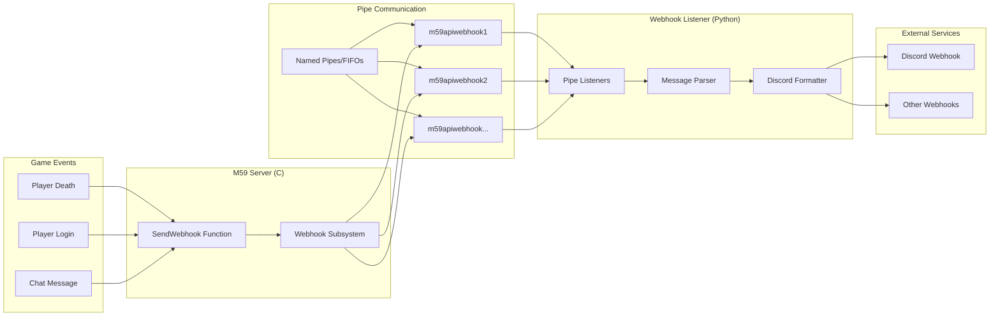
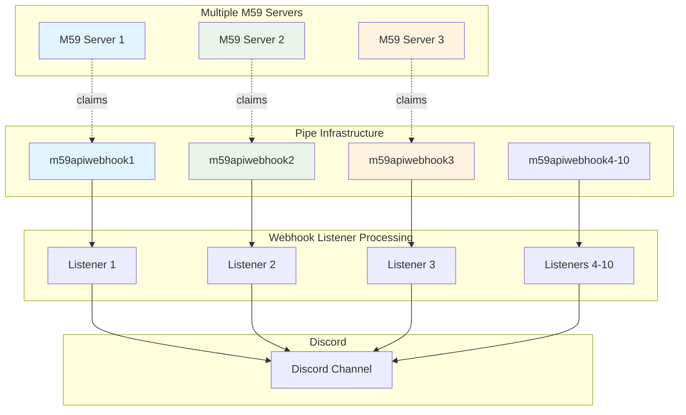

# Meridian 59 Webhook System

The Meridian 59 webhook system enables the game server to send real-time notifications to external services (like Discord) via named pipes or FIFO pipes. This system is designed for performance, reliability, and multi-server support.

## Architecture Overview

The webhook system uses a **client-server pipe architecture**:

- **Webhook Listener (Python)**: Creates and manages pipe servers, forwards messages to Discord/webhooks
- **Meridian 59 Server (C)**: Connects to pipes as a client, sends webhook messages

One example webhook listener is [m59api](https://pypi.org/project/m59api/), but any compatible pipe listener can be used.



### Multi-Server Distribution



## How It Works

### 1. Pipe Creation (webhook listener side)
When the webhook listener starts, it creates multiple named pipes to handle connections:

**Windows**: Creates 10 named pipes
- `\\.\pipe\m59apiwebhook1`  
- `\\.\pipe\m59apiwebhook2`
- ... up to `\\.\pipe\m59apiwebhook10`

**Linux/macOS**: Creates 10 FIFO pipes
- `/tmp/m59apiwebhook1`
- `/tmp/m59apiwebhook2`  
- ... up to `/tmp/m59apiwebhook10`

### 2. Connection (M59 server side)
When the Meridian 59 server starts:

1. **Initialization**: `InitWebhooks()` prepares the webhook subsystem
2. **Connection**: Server attempts to connect to available pipes in sequence
3. **Claiming**: First available pipe is "claimed" and kept open for performance
4. **Messaging**: `SendWebhookMessage()` writes to the claimed pipe
5. **Cleanup**: `ShutdownWebhooks()` closes connections on server shutdown

### 3. Message Flow
```
1. Game Event (e.g., player death)
2. Blakod calls SendWebhook("Player died: Bob killed by Alice")  
3. C_SendWebhook() ? SendWebhookMessage()
4. Format as JSON: {"timestamp":1234567890,"message":"Player died: Bob killed by Alice"}
5. Write to claimed pipe
6. Webhook listener receives message
7. Webhook listener forwards to Discord webhook
8. Discord posts to channel
```

## Multi-Server Support

The system automatically handles multiple M59 servers on the same machine:

### Automatic Pipe Distribution
- **Server 1**: Claims `m59apiwebhook1`
- **Server 2**: Finds `m59apiwebhook1` busy ? Claims `m59apiwebhook2`  
- **Server 3**: Finds `m59apiwebhook1,2` busy ? Claims `m59apiwebhook3`
- Up to **10 concurrent servers** supported per webhook listener instance

### Load Balancing
Each server uses round-robin selection across multiple pipes for better distribution and fault tolerance.

### High-Traffic Performance
The multi-pipe architecture prevents message dropping during high-traffic scenarios:

**Example - Multiple simultaneous events:**
```
Player 1 dies ? m59apiwebhook1 ? Concurrent processing
Player 2 dies ? m59apiwebhook2 ? Concurrent processing  
Player 3 dies ? m59apiwebhook3 ? Concurrent processing
All messages processed simultaneously without blocking
```

**Without multi-pipe design:**
- Single pipe processes one message at a time
- Subsequent messages could be blocked or dropped
- Performance degrades under load

## Performance Features

### Persistent Connections
- **Problem**: Opening/closing pipes for every message is expensive (3 system calls per message)
- **Solution**: Pipes are opened once during server startup and kept open
- **Result**: Only 1 system call per message (WriteFile/write)

### Non-blocking Operations  
- Pipe operations use `O_NONBLOCK` flags to prevent server blocking
- Failed pipe writes are handled gracefully without affecting game performance

## Usage

### Blakod Integration
```blakod
// Send a webhook message from Blakod
SendWebhook("Player login: " + GetPlayerName(player));
SendWebhook("Death message: " + killer + " killed " + victim);
```

### C Code Integration  
```c
// Send webhook message from C code
SendWebhookMessage("Server started", 14);
```

## Configuration

### Basic Setup (Single Server)
No configuration needed. Default pipe names work automatically.

### Multi-Server Setup
If running multiple server instances, no special configuration is required - the system automatically distributes across available pipes.

### Custom Prefixes (Advanced)
For explicit control, webhook prefixes can be used:

```c
InitWebhooks("server1");  // Creates server1_m59apiwebhook1, etc.
InitWebhooks("server2");  // Creates server2_m59apiwebhook1, etc.
```

For example, using m59api as the webhook listener:
```bash
pip install m59api
python -m m59api --webhook-prefix server1
python -m m59api --webhook-prefix server2  
```

## Implementation Details

### Files
- **webhook.h**: Function declarations and constants
- **webhook.c**: Cross-platform implementation
- **ccode.c**: Blakod function `C_SendWebhook()`
- **main.c**: Initialization and shutdown integration

### Key Functions
- `InitWebhooks(prefix)`: Initialize webhook system
- `ShutdownWebhooks()`: Cleanup resources  
- `SendWebhookMessage(message, len)`: Send message via pipe
- `C_SendWebhook()`: Blakod-accessible function

### Cross-Platform Support
The system uses `#ifdef BLAK_PLATFORM_WINDOWS` blocks to handle platform differences:

**Windows**: Named pipes via CreateFileA/WriteFile/CloseHandle
- Creates 10 concurrent pipe servers for high throughput
- Each pipe runs in its own thread for parallel processing

**Linux/macOS**: FIFO pipes via open/write/close  
- Creates 10 concurrent FIFO listeners for high throughput
- Each FIFO runs in its own async task for parallel processing

Both platforms now provide identical performance characteristics and multi-server support.

### Error Handling
- Graceful handling of unavailable pipes (webhook listener not running)
- Automatic retry and failover across multiple pipes
- No impact on game performance if webhook system is unavailable

## Troubleshooting

### Common Issues

**"No webhook messages appearing"**
- Verify webhook listener is running and creating pipes
- Check Discord webhook URL configuration  
- Ensure Blakod is calling `SendWebhook()`
- Ensure webhook system is enabled in main.c (uncomment InitWebhooks)

**"Multiple servers conflicting"**  
- System should handle this automatically
- Check that different servers are claiming different pipe numbers
- Consider using custom prefixes if needed

**"Performance issues"**
- Webhook system is designed for minimal performance impact
- 10 concurrent pipes handle high-traffic scenarios without blocking
- Messages are processed in parallel across multiple pipes/FIFOs
- If issues persist, webhook system can be disabled

### Debug Information
Enable webhook debugging by checking pipe connection status and message flow in server logs.

## Security Considerations

- Pipes are created with appropriate permissions
- Messages are sent locally only (no network access from M59 server)
- m59api handles all external network communication
- Webhook URLs should be kept secure

## Future Enhancements

Possible future improvements:
- Configuration file support for pipe settings
- Additional webhook destinations beyond Discord
- Message queuing for reliability
- Metrics and monitoring integration

---

*This webhook system addresses performance concerns raised in code review by implementing persistent pipe connections, proper cross-platform support, and clean separation of concerns between game server and external service communication.*